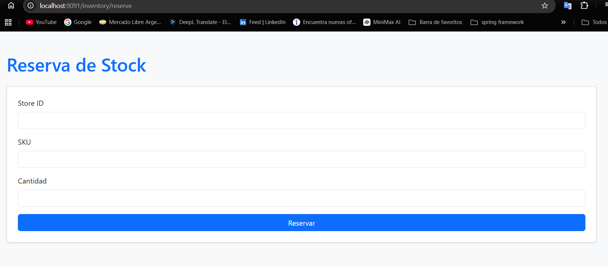
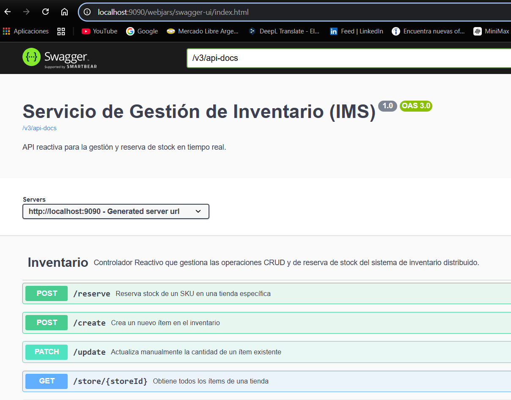
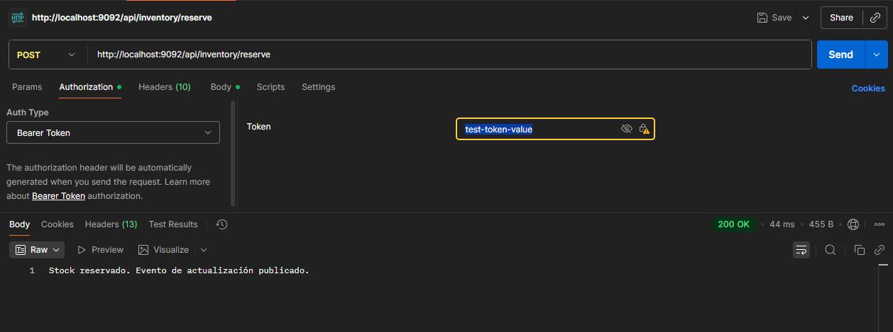
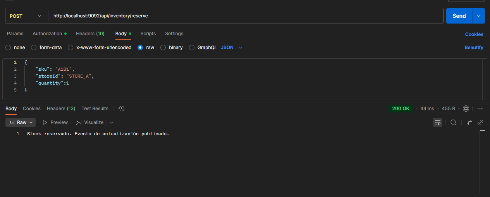

# **Proyecto: Sistema de Gestión Distribuida**

# **Se puede descargar de hithub:**

https://github.com/EstebanLescano/InventoryManagerService

# **_DESCRIPCION_**

📘 Descripción del Proyecto

Este proyecto es un sistema de gestión distribuida basado en microservicios, diseñado siguiendo los principios de Domain-Driven Design (DDD).
El backend está desarrollado con Spring WebFlux, adoptando un enfoque reactivo que mejora la escalabilidad y el manejo
de concurrencia, acompañado por un front-end reactivo y una API Gateway encargado de centralizar la seguridad.
Con el objetivo de simplificar el entorno de desarrollo y pruebas, se eliminó la dependencia de servicios externos 
como Keycloak, Kafka, Redis y bases de datos adicionales. De esta forma, se evita levantar múltiples instancias y se reduce el consumo 
de recursos, manteniendo una implementación ligera y funcional a fines de prueba.
El proyecto incluye tests unitarios en un servicio, además de documentación con Swagger, lo que facilita su despliegue, 
mantenimiento y ejecución en cualquier entorno.

# _**DIAGRAMA_** :

# **_ARQUITECTURA_**

Microservicios Backend:
Separación clara entre service, models, repository y controller.
Comunicación reactiva usando Spring WebFlux y WebClient.

Persistencia reactiva con R2DBC (en este caso fue usado una h2 en memoria). Podria usarse con postgresql, mysql, etc.

API Gateway:
Centraliza el enrutamiento a los microservicios.
Protege los endpoints mediante JWT generado por Keycloak. En este caso solo hemos simulado un token válido para pruebas locales.
Permite balanceo de carga y manejo de rutas.

Front-end Reactivo:
Consume microservicios a través del API Gateway.
Soporta flujos reactivos y UI dinámica.
Si bien el front no es funcional solo se realizó con el fin de demostrar la conexion a un front

Seguridad:
Keycloak maneja autenticación y autorización por roles y recursos (Rbac).
Roles definidos por microservicio y realm, aplicando RBAC.
En este cazo solo se realizó una simulacion creando un FakeToken.

Documentación:
Cada servicio expone su documentación Swagger en /swagger-ui.html.
Contenerización: Docker / Docker Compose. No se realizó a fin facilitar pruebas

# **_TECNOLOGIAS_**

Backend: Java 21, Spring Boot, Spring AI, Spring WebFlux, R2DBC.
Frontend: Reactivo (Spring WebFlux + Thymeleaf).
Seguridad: Keycloak (JWT, roles, permisos). Este paso se simulo para pruebas locales.
Base de datos: H2 para pruebas.
Testing: JUnit 5, Spring Boot Test, unitarios.
Build: Maven.
Documentación API: Swagger / OpenAPI.
Contenerización: Docker / Docker Compose.(en caso de levantar instancias de keycloak o kafka)

# **_ESTRUCTURA DEL PROYECTO_**

/inventory-manager-service
├── imsBack
│   ├── src
│   │   ├── main
│   │   │   ├── java
│   │   │   │   └── org.lea.imsback
│   │   │   │       ├── controllers
│   │   │   │       ├── services
│   │   │   │       ├── repositories
│   │   │   │       └── models
│   │   │   └── resources
│   │   │       └── application.properties
│   │   └── test
│   ├── pom.xml
│   └── target/
│
├── imsFront
│   ├── src
│   │   ├── main
│   │   │   ├── java
│   │   │   │   └── org.lea.imsfront
│   │   │   │       ├── config
│   │   │   │       │   └── WebClientConfig.java
│   │   │   │       ├── controllers
│   │   │   │       │   └── InventoryController.java
│   │   │   │       ├── models
│   │   │   │       └── ImsFrontApplication.java
│   │   │   └── resources
│   │   │       ├── templates
│   │   │       │   └── reserve.html
│   │   │       └── application.properties
│   │   └── test
│   ├── pom.xml
│   └── target/
│
├── imsGetaway
│   ├── src
│   │   ├── main
│   │   │   ├── java
│   │   │   │   └── org.lea.imsgetaway
│   │   │   │       ├── config
│   │   │   │       │   ├── JwtDecoder.java
│   │   │   │       │   └── SecurityConfig.java
│   │   │   │       ├── filters
│   │   │   │       ├── routes
│   │   │   │       └── ImsGetawayApplication.java
│   │   │   └── resources
│   │   │       └── application.properties
│   │   └── test
│   ├── pom.xml
│   └── target/
│
├── docker-compose.yml
├── HELP.md
├── README.md
└── DIAGRAMA_IMS.txt

# **_ENDPOINT PRINCIPALES_**

Los endpoints aquí son ejemplos; cada servicio tiene su propia documentación Swagger.

Microservicio de Inventario

#### Método	Ruta	Descripción
POST	/api/inventory/reserve	Reserva stock de un SKU en una tienda.
POST	/api/inventory/create	Crea un nuevo ítem en el inventario.
GET	/api/inventory/store/{storeId}	Obtiene todos los ítems de una tienda.
GET	/api/inventory/store/{storeId}/sku/{sku}	Obtiene un ítem específico por tienda y SKU.
PATCH	/api/inventory/update	Actualiza la cantidad de un ítem existente.
DELETE	/api/inventory/delete/{storeId}/{sku}	Elimina un ítem del inventario.

#### **Ejemplo de request para reservar stock:**

_{
"storeId": "STORE_A",
"sku": "A101",
"quantity": 10
}_

# Se utiliza Spring AI para la gestión avanzada de errores:

En este endpoint se realizo en el Servicio **tryReserveStock**: El servicio garantiza que solo los errores verdaderamente 
inesperados (que él no pueda controlar, como un StackOverflowError o un error que no interceptó) lleguen al controlador.
y en el caso de que llegue al controllador  **reserveStock** El controlador maneja el límite del sistema. Si una excepción logra subir hasta aquí, 
es un fallo crítico del sistema, y es el lugar ideal para activar herramientas de diagnóstico de alto nivel como la IA, 
ya que ya ha pasado por todas las defensas internas.

# Cómo ejecutar

Levantar el proyecto ImsBack, Gateway y Frontend (uso intellij)
una vez levantado los tres servicios.
frontend: http://localhost:9091/inventory/reserve

gateway: http://localhost:9092/actuator/health

ims-back: http://localhost:9090/webjars/swagger-ui/index.html

Para poder hacer una peticion por postman al estar conectado con el gateway
se debe agregar en los headers la autorizacion con el token: **_test-token-value_** 
se realizó de esta forma para no tener que levantar keycloak y asi simplificar el proyecto
para pruebas locales. Se hizo una simulacion de token válido para el gateway. 

# Funcionamiento

En esta Img se muestra como funciona Spring AI usandolo como logueo si se requiere reproducir hay que 
poner en las properties la key de openAI

#### rate-limiting:
Se aplica rateLimit a una sola ruta con el fin de demostrar como se hace esta en memoria con h2 
la otra forma de hacerlo es levantar instancia de redis y configurar dentro del properties los rateLimit

# Notas finales
Este proyecto es una base sólida para construir sistemas de gestión distribuidos
utilizando microservicios y DDD. Se puede extender fácilmente añadiendo más microservicios,
integrando bases de datos reales y servicios externos según las necesidades del negocio.
¡Gracias por revisar el proyecto!