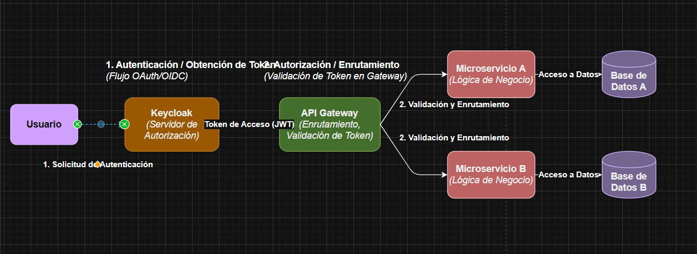
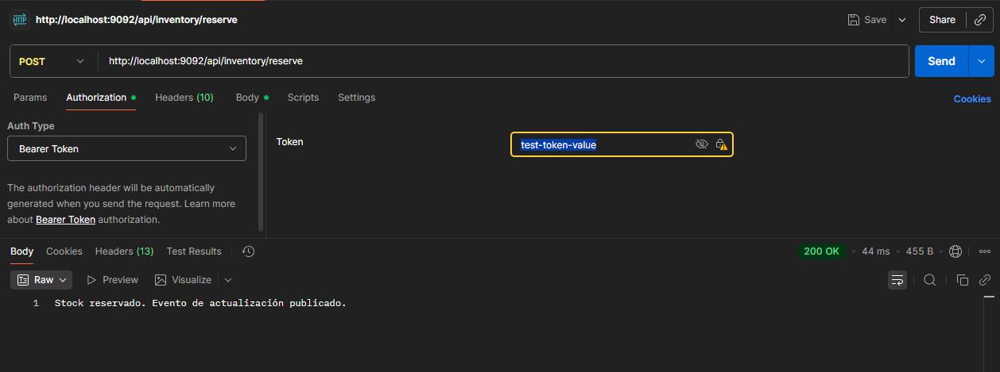
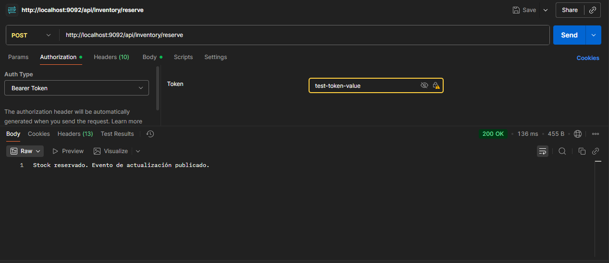
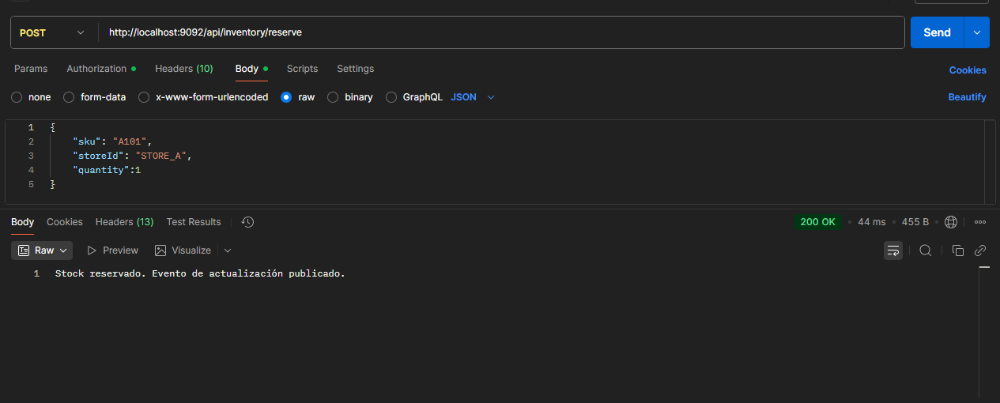

# **Proyecto: Sistema de Gestión Distribuida**

# **Se puede descargar de hithub:**

https://github.com/EstebanLescano/InventoryManagerService

# **_DESCRIPCION_**

Este proyecto es un sistema de gestión distribuida basado en microservicios, 
diseñado siguiendo los principios de Domain-Driven Design (DDD).
El backend está implementado con Spring WebFlux para un enfoque reactivo, 
acompañado de un front-end reactivo y un API Gateway que centraliza la seguridad.

Para simplificar el entorno de desarrollo y pruebas, se eliminó la dependencia de servicios
externos como Keycloak, Kafka y bases de datos adicionales, evitando así la necesidad de levantar
múltiples instancias y el consumo excesivo de recursos. La implementación se mantiene lo más simple
y ligera posible, sin perder funcionalidad.

El proyecto incluye tests unitarios e integrales, documentación Swagger, facilitando su despliegue
y ejecución en cualquier entorno.

# _**DIAGRAMA_** :

# **_ARQUITECTURA_**

Microservicios Backend:

Separación clara entre domain, service, repository y controller.

Comunicación reactiva usando Spring WebFlux y WebClient.

Persistencia reactiva con R2DBC (para bases como PostgreSQL).

API Gateway:

Centraliza el enrutamiento a los microservicios.

Protege los endpoints mediante JWT generado por Keycloak.

Permite balanceo de carga y manejo de rutas.

Front-end Reactivo:

Consume microservicios a través del API Gateway.

Soporta flujos reactivos y UI dinámica.

Seguridad:

Keycloak maneja autenticación y autorización por roles y recursos.

Roles definidos por microservicio y realm, aplicando RBAC.

Documentación:

Cada servicio expone su documentación Swagger en /swagger-ui.html.

Contenerización: Docker / Docker Compose.

# **_TECNOLOGIAS_**

Backend: Java 21, Spring Boot, Spring WebFlux, R2DBC.

Frontend: Reactivo (Spring WebFlux + Thymeleaf o React).

Seguridad: Keycloak (JWT, roles, permisos).

Base de datos: H2 para pruebas.

Testing: JUnit 5, Spring Boot Test, unitarios.

Build: Maven.

Documentación API: Swagger / OpenAPI.

Contenerización: Docker / Docker Compose.

# **_ESTRUCTURA DEL PROYECTO_**

/project-root
├── backend-service-1
│   ├── src/main/java
│   │   ├── controller
│   │   ├── service
│   │   ├── repository
│   │   └── domain
│   └── resources
├── backend-service-2
│   └── ...
├── frontend
│   └── ...
├── api-gateway
│   └── ...
├── docker-compose.yml
└── README.md

# **_FLUJO DE AUTENTICACION_**

1- El usuario inicia sesión a través de Keycloak.
2- Keycloak emite un JWT con roles y permisos.
3- El API Gateway valida el token y enruta la petición al microservicio correspondiente.
4- Los microservicios verifican los roles y permisos según RBAC antes de procesar la solicitud.

# **_ENDPOINT PRINCIPALES_**

Los endpoints aquí son ejemplos; cada servicio tiene su propia documentación Swagger.

Microservicio de Inventario
Método	Ruta	Descripción
GET	/api/v1/inventory/{id}	Obtener stock por producto
POST	/api/v1/inventory/reserve	Reservar stock
PUT	/api/v1/inventory/{id}	Actualizar stock

**Ejemplo de request para reservar stock:**
{
"storeId": "STORE_A",
"sku": "A101",
"quantity": 10
}

# Cómo ejecutar

Levantar el proyecto ImsBack, Gateway y Frontend (uso intellij)
una vez levantado los tres servicios.
frontend: http://localhost:9091/inventory/reserve

gateway: http://localhost:9092/actuator/health

ims-back: http://localhost:9090/webjars/swagger-ui/index.html

para poder hacer una peticion por postman al estar conectado con el gateway
se debe agregar en los headers la autorizacion con el token: test-token-value 
se realizo de esta forma para no tener que levantar keycloak y asi simplificar el proyecto
para pruebas locales. Se hizo una simulacion de token valido para el gateway. 

# Funcionamiento

# Notas finales
Este proyecto es una base sólida para construir sistemas de gestión distribuidos
utilizando microservicios y DDD. Se puede extender fácilmente añadiendo más microserv
icios, integrando bases de datos reales y servicios externos según las necesidades del negocio.
¡Gracias por revisar el proyecto!